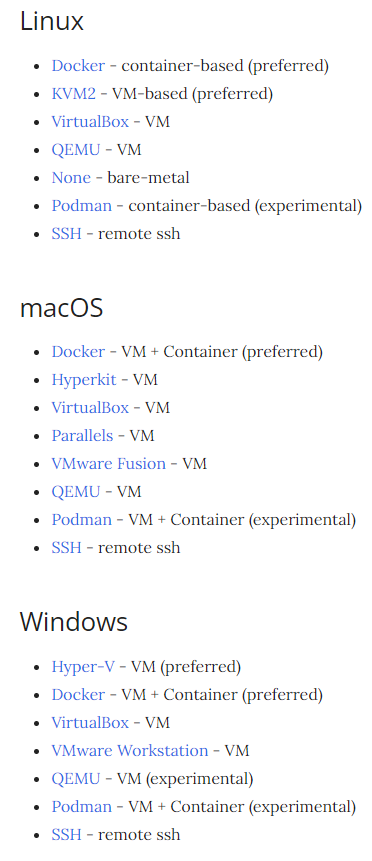

# Ad. 1

## Prerequisites

Trzeba najpierw mieć zainstalowane: 
1. Docker
2. Minikube
3. Helm

## Komendy 
Zbudowanie obrazu z tagiem (nazwą) "lab7":  
`docker build -t lab7 . -v /dbdata`

Uruchomienie kontenera z powyższego obrazu:

`docker run -it -v ${HOME}/.aws:/root/.aws lab7`

Rozmiar obrazu: 216 MB

# Ad. 2
- a)
Docker jest domyślnym driverem dla minikube na WSL2, ale można uruchomić minkikube z wybranym driverem w ten sposób:
`minikube start --vm-driver=docker`
Inne drivery to na przykład:  

- b)
plik `install-ganesha.sh` zawiera komendy do zainstalowania provisionera pvc

trzeba pobrać obraz provisionera:
`docker pull k8s.gcr.io/sig-storage/nfs-provisioner:v3.0.0`

argument z nazwą provisionera: "ganesha/nfs"

Uruchomienie obiektów kubernetes z pliku:
`kubectl apply -f nginx.deployment.yml`

żeby loadBalancer działał, potrzebny jest `minikube tunnel` działający w jakimś terminalu (ten terminal będzie zablokowany); to jest quirk minikube'a, normalnie nie trzeba tak robić

## Warto poczytać

O kolejności komnend w Dockerfile:
https://stackoverflow.com/questions/39223249/multiple-run-vs-single-chained-run-in-dockerfile-which-is-better

## log
używam `minikube dashboard --url`, to daje ładny dashboard i w konsoli daje link do niego 

